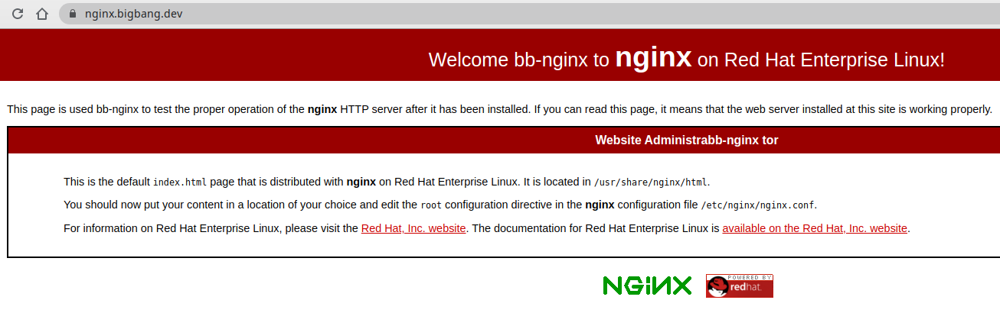
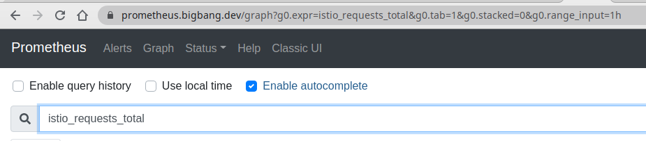
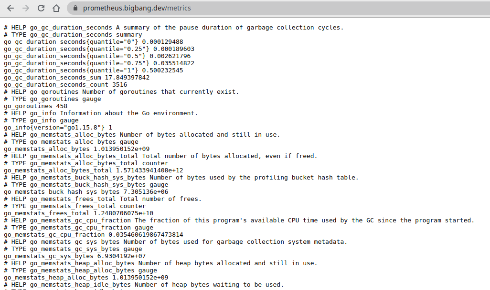
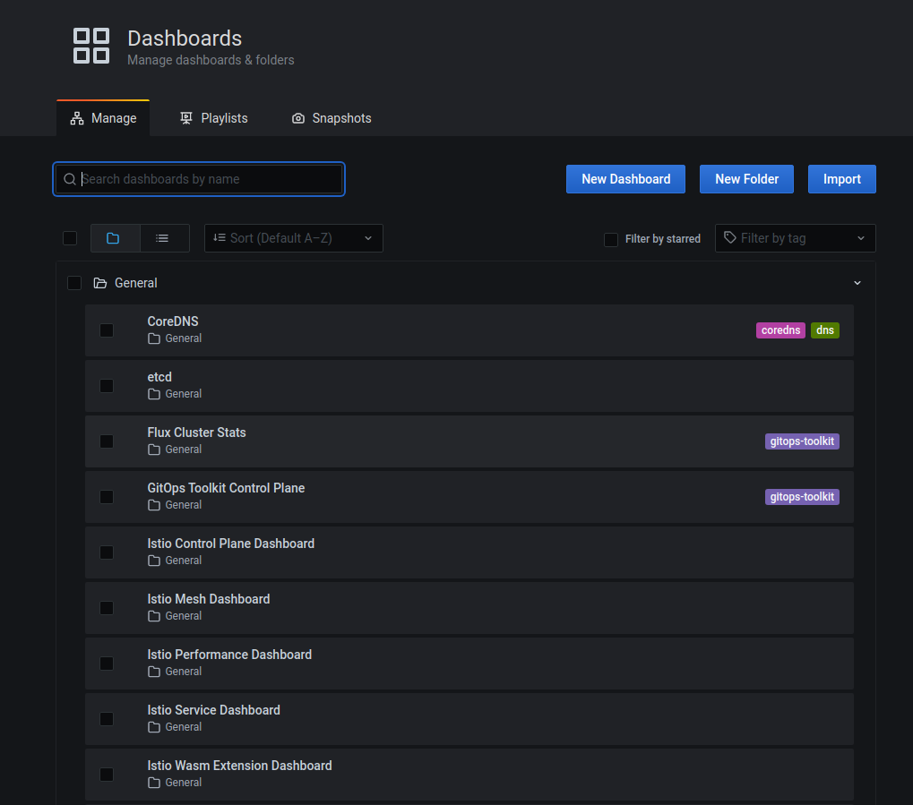
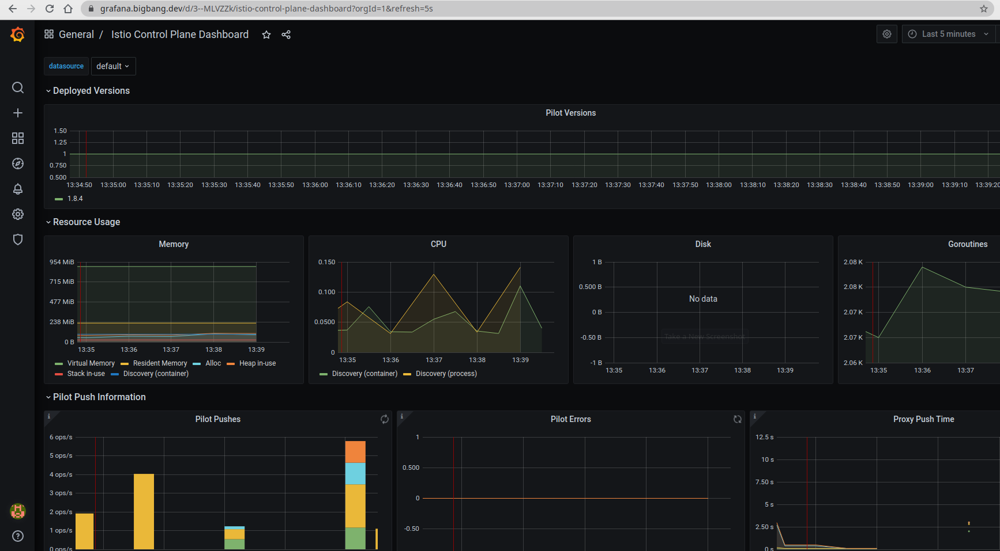
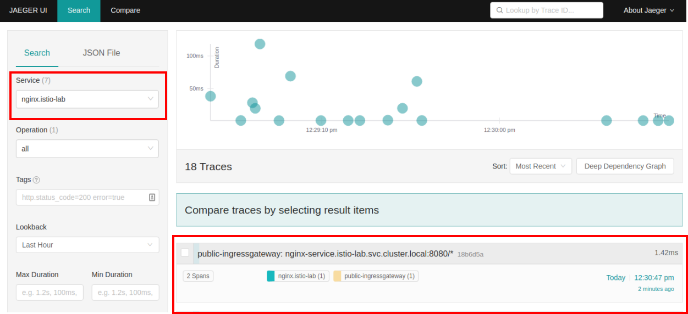
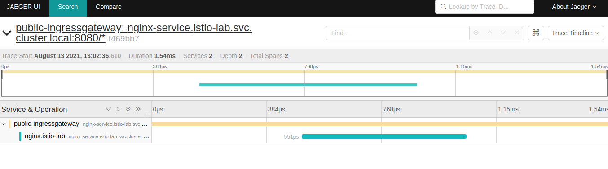
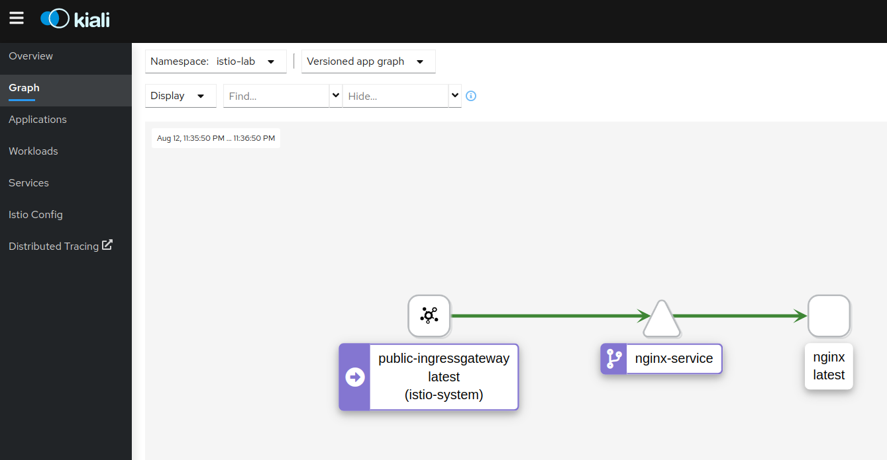
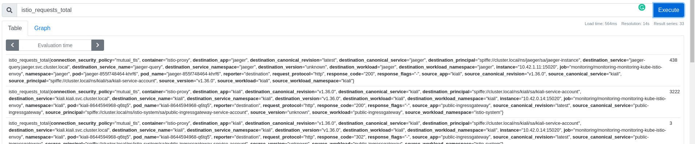
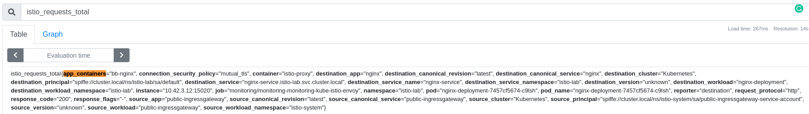

# Observability - Telemetry and Logs

<br>

**Content**:
  - [Environment settings](#environment-settings)
  - [Deploying a sample app](#deploying-a-sample-app)
  - [Prometheus](#prometheus)
  - [Grafana Dashboards](#grafana-dashboards)
  - [Distributed Tracing with Jaeger](#distributed-tracing-with-jaeger)
  - [Mesh Observability with Kiali](#mesh-observability-with-kiali)
    - [Adding a dimension to existing metric](#adding-a-dimension-to-existing-metric)
  - [Clean-up](#clean-up)


Let's enable automatic sidecar injection on the `default` namespace by adding the label istio-injection=enabled:

```bash
kubectl label namespace default istio-injection=enabled
```

>The following YAML defines declaratively the namespace `example-ns` with `istio-injection` label.

>```yaml
kind: Namespace
apiVersion: v1
metadata:
  name: example-ns
  labels:
    istio-injection=enabled
```


Check that the `default` namespace contains the label for Istio proxy injection.

```bash
kubectl get namespace -L istio-injection
```

```bash
default             Active   19h   enabled
kube-system         Active   19h
kube-public         Active   19h
kube-node-lease     Active   19h
flux-system         Active   19h
bigbang             Active   16h
jaeger              Active   16h   enabled
gatekeeper-system   Active   16h
istio-operator      Active   16h   disabled
logging             Active   16h   enabled
monitoring          Active   16h
kiali               Active   16h   enabled
istio-system        Active   16h
eck-operator        Active   16h
```


## Deploying a sample app

### 1. Create a new directory for istio

```bash
mkdir -p /home/istio-nginx-lab
cd /home/istio-nginx-lab
```

### 2. Create directories for manifests, manifests/app, manifests/istio

```bash
mkdir -p manifests/app
mkdir -p manifests/istio
```

### 3. Create a nginx-configmap.yaml file inside manifests/app

A ConfigMap is an API object used to store non-confidential data in key-value pairs. Pods can consume ConfigMaps as environment variables, command-line arguments, or as configuration files in a volume. A ConfigMap allows you to decouple environment-specific configuration from your container images, so that your applications are easily portable.

Create ConfigMap to configure nginx:

```bash
vi manifests/app/nginx-configmap.yaml
```

```yaml
apiVersion: v1
kind: ConfigMap
metadata:
  name: my-nginx-config
data:
  nginx.conf: |
    user nginx;
    worker_processes auto;
    error_log /var/log/nginx/error.log;
    #pid /run/nginx.pid;
    pid /tmp/nginx.pid;
    # Load dynamic modules. See /usr/share/doc/nginx/README.dynamic.
    include /usr/share/nginx/modules/*.conf;
    events {
        worker_connections 1024;
    }
    http {
        log_format  main  '$remote_addr - $remote_user [$time_local] "$request" '
                          '$status $body_bytes_sent "$http_referer" '
                          '"$http_user_agent" "$http_x_forwarded_for"';
        access_log  /var/log/nginx/access.log  main;
        sendfile            on;
        tcp_nopush          on;
        tcp_nodelay         on;
        keepalive_timeout   65;
        types_hash_max_size 2048;
        include             /etc/nginx/mime.types;
        default_type        application/octet-stream;
        include /etc/nginx/conf.d/*.conf;
        server {
            listen       7000 default_server;
            listen       [::]:7000 default_server;
            server_name  _;
            root         /usr/share/nginx/html;
            # Load configuration files for the default server block.
            include /etc/nginx/default.d/*.conf;
            location / {
            }
            error_page 404 /404.html;
                location = /40x.html {
            }
            location /health {
                access_log off;
                return 200 "healthy\n";
            }
            error_page 500 502 503 504 /50x.html;
                location = /50x.html {
            }
        }
    }

```

### 4. Create a nginx-deployment.yaml file inside manifests/app

```bash
vi manifests/app/nginx-deployment.yaml
```

```yaml
apiVersion: apps/v1
kind: Deployment
metadata:
  name: nginx-deployment
  labels:
    app: nginx
  annotations:
    sidecar.istio.io/rewriteAppHTTPProbers: "true"
spec:
  replicas: 1
  selector:
    matchLabels:
      app: nginx
  template:
    metadata:
      labels:
        app: nginx
    spec:
      containers:
      - name: nginx
        image: docker.io/nginx:1.21.3
        ports:
        - containerPort: 7000
        resources:
          requests:
            memory: "64Mi"
            cpu: "100m"
          limits:
            memory: "128Mi"
            cpu: "500m"
        livenessProbe:
          httpGet:
            path: /health
            port: 7000
          initialDelaySeconds: 5
          periodSeconds: 5
        readinessProbe:
          httpGet:
            path: /health
            port: 7000
          initialDelaySeconds: 10
          periodSeconds: 10
        volumeMounts:
        - name: my-nginx-config
          mountPath: /etc/nginx/nginx.conf
          subPath: nginx.conf
      volumes:
        - name: my-nginx-config
          configMap:
            name: my-nginx-config

```

### 5. Create a service.yaml file inside manifests/app

```bash
vi manifests/app/nginx-service.yaml
```

```yaml
apiVersion: v1
kind: Service
metadata:
  name: nginx-service
spec:
  ports:
  - port: 8080
    name: http
    protocol: TCP
    targetPort: 7000
  selector:
    app: nginx
  sessionAffinity: None
  type: ClusterIP

```
### 6. Apply the configmap, deployment, and service resources you created

> OPA gatekeeper has a few bundled policies that ship as part of Big Bang. One of these policies is a list of "allowed repositories" which pin to only Iron Bank Images. As a workaround for this lab we will disable OPA gatekeeper enforcement for `default` namespace.

>`kubectl edit k8sallowedrepos.constraints.gatekeeper.sh/allowed-docker-registries`


```yaml
...
spec:
  enforcementAction: deny
  match:
    excludedNamespaces:
    - istio-system
    - default
...
```

```bash
kubectl apply -f manifests/app
```

### 7. Make sure that the application page is reachable via a direct port forward from your machine

```bash
kubectl port-forward service/nginx-service 8080:8080
```

>Access the nginx page on http://localhost:8080 to confirm service is up.


### 8. Create a virtualservice.yaml file inside manifests/istio

```bash
vi manifests/istio/nginx-virtualservice.yaml
```

```yaml

apiVersion: networking.istio.io/v1alpha3
kind: VirtualService
metadata:
  name: nginx-virtualservice
spec:
  gateways:
  - istio-system/public
  hosts:
  - nginx.bigbang.dev
  http:
  - route:
    - destination:
         host: nginx-service
         port:
            number: 8080

```

### 9. Apply the virtualservice

```bash
kubectl apply -f manifests/istio/nginx
virtualservice.networking.istio.io/nginx-virtualservice created
```
Check that the `nginx-virtualservice` virtual service is correct.

```bash
kubectl get vs -n=istio-lab
NAME                   GATEWAYS                HOSTS                       AGE
nginx-virtualservice   ["istio-system/public"]   ["nginx.bigbang.dev"]   78s
```

### 10. DNS Configuration

To reach the host `nginx.bigbang.dev`, it is necessary to add the following line in /etc/hosts:

```bash
<public-ip> nginx.bigbang.dev
```


### 11.  Access the application at the following address

```bash
https://nginx.bigbang.dev
```


## Prometheus

Prometheus is an open-source monitoring system and time series database. Istio uses Prometheus to record metrics that track the health of Istio and applications in the mesh.

<br>

### Open Prometheus GUI

We are going to open now https://prometheus.bigbang.dev in a browser to get to the Prometheus dashboard, as shown in the figure below.



Lets look at raw prometheues metrics. Navigate to https://prometheus.bigbang.dev/metrics

>The only goal here is to get an idea of what they look like



Open another terminal tab and let's make a couple of requests to the nginx server we've created at the beginning. Then, from the Prometheus UI you can search for one of the Istio metrics (istio_requests_total for example) to get the idea on what data is being collected for requests.

Here's an example element from the Prometheus UI:

```bash
istio_requests_total{connection_security_policy="mutual_tls", container="istio-proxy", destination_app="nginx", destination_canonical_revision="latest", destination_canonical_service="nginx", destination_principal="spiffe://cluster.local/ns/istio-lab/sa/default", destination_service="nginx-service.istio-lab.svc.cluster.local", destination_service_name="nginx-service", destination_service_namespace="istio-lab", destination_version="unknown", destination_workload="nginx-deployment", destination_workload_namespace="istio-lab", instance="10.42.0.26:15020", job="monitoring/monitoring-monitoring-kube-istio-envoy", namespace="istio-lab", pod="nginx-deployment-6b66779948-gzxhl", pod_name="nginx-deployment-6b66779948-gzxhl", reporter="destination", request_protocol="http", response_code="200", response_flags="-", source_app="public-ingressgateway", source_canonical_revision="latest", source_canonical_service="public-ingressgateway", source_principal="spiffe://cluster.local/ns/istio-system/sa/public-ingressgateway-service-account", source_version="unknown", source_workload="public-ingressgateway", source_workload_namespace="istio-system"}
```

## Grafana Dashboards

Grafana is an open platform for analytics and monitoring. Grafana can connect to various data sources and visualizes the data using graphs, tables, heatmaps, etc. With a powerful query language, you can customize the existing dashboard and create more advanced visualizations. With Grafana, we can monitor the health of Istio installation and applications running in the service mesh.

### Login to Grafana
Open in a web browser: https://grafana.bigbang.dev/

```bash
Login with:

username: admin
password: prom-operator
```

### Navigate to Grafana Dashboard

Below are some of the installed dashboards:



For example from the Istio control plane dashboard, we can monitor the health and performance of the Istio control plane. This dashboard will show us the resource usage (memory, CPU, disk, Go routines) of the control plane, and information about the pilot, Envoy, and webhooks.




## Distributed Tracing with Jaeger

Distributed tracing enables users to track a request through mesh that is distributed across multiple services. This allows a deeper understanding about request latency, serialization and parallelism via visualization.

Although Istio proxies are able to automatically send spans, they need some hints to tie together the entire trace. Applications need to propagate the appropriate HTTP headers so that when the proxies send span information, the spans can be correlated correctly into a single trace. By propagating the relevant headers from your applications, you can help Jaeger stitch together the traces.

To do this, an application needs to collect and propagate the following headers from the incoming request to any outgoing requests:

* `x-request-id`
* `x-b3-traceid`
* `x-b3-spanid`
* `x-b3-parentspanid`
* `x-b3-sampled`
* `x-b3-flags`
* `x-ot-span-context`

When downstream calls are make in the application, make sure to include these headers. The most common way to propagate the headers is to copy them from the incoming request and include them in all outgoing requests made from your applications. Traces you get with Istio service mesh are only captured at the service boundaries. To understand the application behavior and troubleshoot problems, you need to properly instrument your applications by creating additional spans.

To see trace data, you must send requests to the service `nginx`. The number of requests depends on Istio’s sampling rate. You set this rate when you install Istio.

To find out what the default rate is, execute and find the value of the `Tracing: sampling` parameter with the following command:

```bash
kubectl describe IstioOperator -n istio-system
```
The sampling rate is 10%. You need to send at least 1000 requests before the first trace is visible. To send a 1000 requests to the productpage service, use the following command:

```bash
for i in $(seq 1 1000); do curl -s -o /dev/null "https://nginx.bigbang.dev"; done
```

Open in a web browser: https://tracing.bigbang.dev

From the left-hand pane of the dashboard, select `nginx.istio-lab` from the Service drop-down list and click Find Traces:



Click on the most recent trace at the top to see the details corresponding to the latest request to the `nginx.bigbang.dev` page:



The trace is comprised of a set of spans, where each span corresponds to a `bb-nginx` service, invoked during the execution of a request.

## Mesh Observability with Kiali

Kiali is a management console for Istio-based service mesh. It provides dashboards, observability and lets us operate the mesh with robust configuration and validation capabilities. It shows the service mesh structure by inferring traffic topology and displays the health of the mesh. Kiali provides detailed metrics, powerful validation, Grafana access, and strong integration for distributed tracing with Jaeger.

When configuring Kiali to use the token auth strategy, it requires users to log into Kiali as a specific user via the user’s service account token. Thus, in order to log into Kiali you must provide a valid Kubernetes token. You can extract a service account’s token from the secret that was created for you when you created the service account.

```bash
kubectl get secret -n kiali $(kubectl get sa kiali-service-account -n kiali -o jsonpath={.secrets[0].name}) -o jsonpath={.data.token} | base64 -d
```



To view the graph of the current system, click the Graph link from the sidebar, then select the `istio-lab` Namespace from the "Select Namespaces" dropdown. Make a couple of requests to the Nginx service and Kiali will draw the graph based on the information from the proxies.

The graph shows us the service topology and visualizes how the services communicate. It also shows the inbound and outbound metrics. Colors in the graph represent the health of the service mesh. A node colored red or orange might need attention. The color of an edge between components represents the health of the requests between those components. The node shape indicates the type of components, such as services, workloads, or apps.

The health of nodes and edges is refreshed automatically based on the user’s preference. The graph can also be paused to examine a particular state, or replayed to re-examine a particular period.


## Customizing metrics

Let's look at the metrics that are being collected by the mesh. We'll use the Nginx deployment we've created earlier. Use curl or just navigate to `nginx.bigbang.dev` to send a couple of requests to the Nginx deployment to generate some data for the metrics.

Next, you can navigate to `prometheus.bigbang.dev/graph` and look at the istio_requests_total metric:



### Adding a dimension to existing metric

Let's use an example where we add a new dimension called `app_containers` to the istio_requests_total metric.

To do that, we'll create a new EnvoyFilter that adds the dimension:
```bash
vi manifests/istio/add-dimension-ef.yaml
```

```yaml
apiVersion: networking.istio.io/v1alpha3
kind: EnvoyFilter
metadata:
  name: update-envoy-metric
spec:
  workloadSelector:
    label:
      app: nginx
  configPatches:
  - applyTo: HTTP_FILTER
    match:
      context: SIDECAR_OUTBOUND
      listener:
        filterChain:
          filter:
            name: envoy.filters.network.http_connection_manager
            subFilter:
              name: envoy.filters.http.router
    patch:
      operation: INSERT_BEFORE
      value:
        name: istio.stats
        typed_config:
          '@type': type.googleapis.com/udpa.type.v1.TypedStruct
          type_url: type.googleapis.com/envoy.extensions.filters.http.wasm.v3.Wasm
          value:
            config:
              configuration:
                '@type': type.googleapis.com/google.protobuf.StringValue
                value: |
                  {
                    "debug": "false",
                    "stat_prefix": "istio"
                    "metrics": [
                        {
                        "name": "requests_total",
                        "dimensions": {
                          "app_containers": "node.metadata['APP_CONTAINERS']"
                        },
                      },
                    ]
                  }
              root_id: stats_outbound
              vm_config:
                code:
                  local:
                    inline_string: envoy.wasm.stats
                runtime: envoy.wasm.runtime.null
                vm_id: stats_outbound
  - applyTo: HTTP_FILTER
    match:
      context: SIDECAR_INBOUND
      listener:
        filterChain:
          filter:
            name: envoy.filters.network.http_connection_manager
            subFilter:
              name: envoy.filters.http.router
    patch:
      operation: INSERT_BEFORE
      value:
        name: istio.stats
        typed_config:
          '@type': type.googleapis.com/udpa.type.v1.TypedStruct
          type_url: type.googleapis.com/envoy.extensions.filters.http.wasm.v3.Wasm
          value:
            config:
              configuration:
                '@type': type.googleapis.com/google.protobuf.StringValue
                value: |
                  {
                    "debug": "false",
                    "stat_prefix": "istio",
                    "metrics": [
                      {
                        "name": "requests_total",
                        "dimensions": {
                          "app_containers": "node.metadata['APP_CONTAINERS']"
                        }
                      },
                      {
                        "dimensions": {
                          "destination_cluster": "node.metadata['CLUSTER_ID']",
                          "source_cluster": "downstream_peer.cluster_id"
                        }
                      }
                    ]
                  }
              root_id: stats_inbound
              vm_config:
                code:
                  local:
                    inline_string: envoy.wasm.stats
                runtime: envoy.wasm.runtime.null
                vm_id: stats_inbound
  - applyTo: HTTP_FILTER
    match:
      context: GATEWAY
      listener:
        filterChain:
          filter:
            name: envoy.filters.network.http_connection_manager
            subFilter:
              name: envoy.filters.http.router
    patch:
      operation: INSERT_BEFORE
      value:
        name: istio.stats
        typed_config:
          '@type': type.googleapis.com/udpa.type.v1.TypedStruct
          type_url: type.googleapis.com/envoy.extensions.filters.http.wasm.v3.Wasm
          value:
            config:
              configuration:
                '@type': type.googleapis.com/google.protobuf.StringValue
                value: |
                  {
                    "debug": "false",
                    "stat_prefix": "istio",
                    "disable_host_header_fallback": true
                    "metrics": [
                      {
                        "name": "requests_total",
                        "dimensions": {
                          "app_containers": "node.metadata['APP_CONTAINERS']"
                        }
                      },
                        {
                        "name": "requests_total",
                        "dimensions": {
                          "platform": "node.metadata['PLATFORM_METADATA'].gcp_gce_instance",
                        },
                      },
                    ]
                  }
              root_id: stats_outbound
              vm_config:
                code:
                  local:
                    inline_string: envoy.wasm.stats
                runtime: envoy.wasm.runtime.null
                vm_id: stats_outbound

```

Deploy the envoy filter:
```bash
kubectl apply -f manifests/istio/add-dimension-ef.yaml
```

Because the `app_containers` is not in the list of default stat tags, we need to include it. The way to do that is adding an annotation to the Pod spec.

Let's edit the nginx deployment and add the following annotation:

```yaml
...
template:
  metadata:
    labels:
        app: nginx
    annotations:
      sidecar.istio.io/extraStatTags: app_containers
```

Save the changes and wait for the Pod to be restarted. Once the Pod restarts, make a couple of requests to the nginx and then look how the `istio_requests_total` request now, returns the new dimension:




## Clean-up
The following commands will clean-up your cluster.


```bash
kubectl delete -f manifests/app
configmap "my-nginx-config" deleted
deployment.apps "nginx-deployment" deleted
service "nginx-service" deleted
```

```bash
kubectl delete -f manifests/istio
envoyfilter.networking.istio.io "update-envoy-metric" deleted
virtualservice.networking.istio.io "nginx-virtualservice" deleted
```
