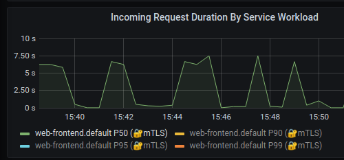
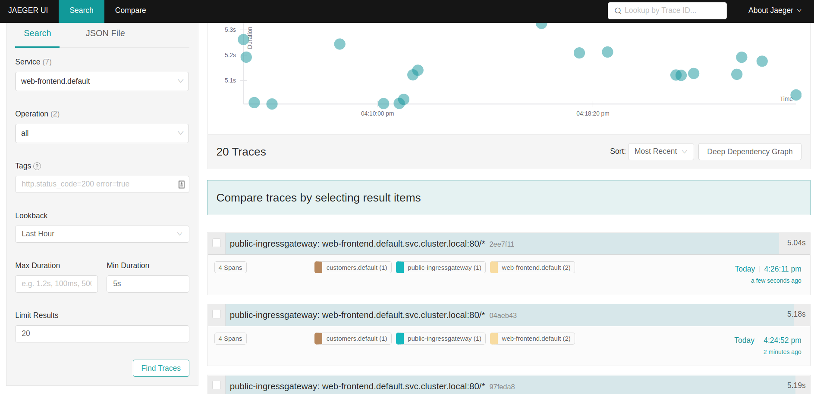
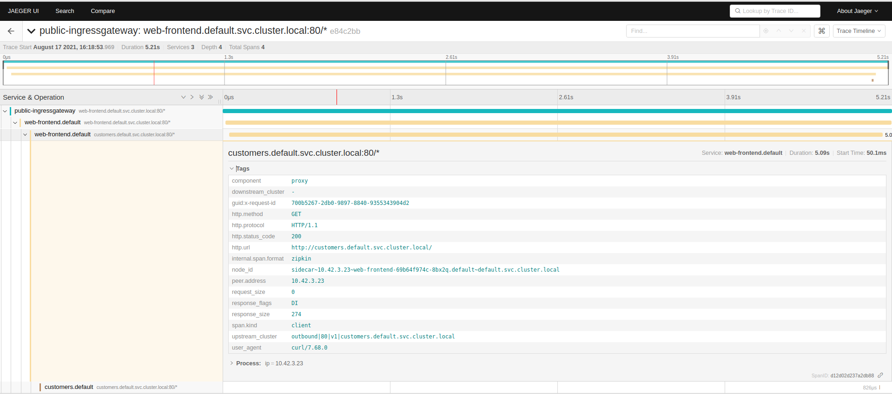
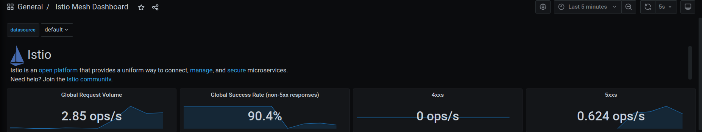
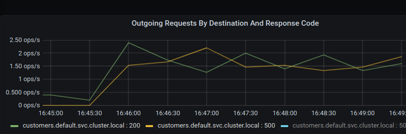
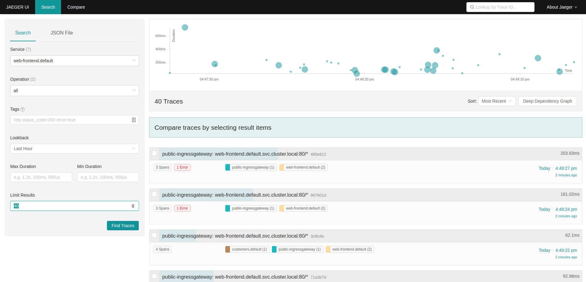
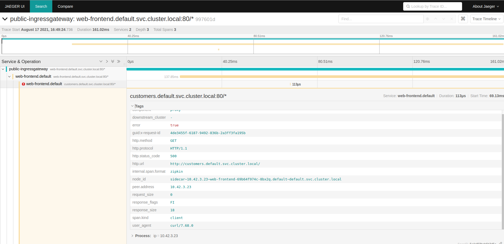
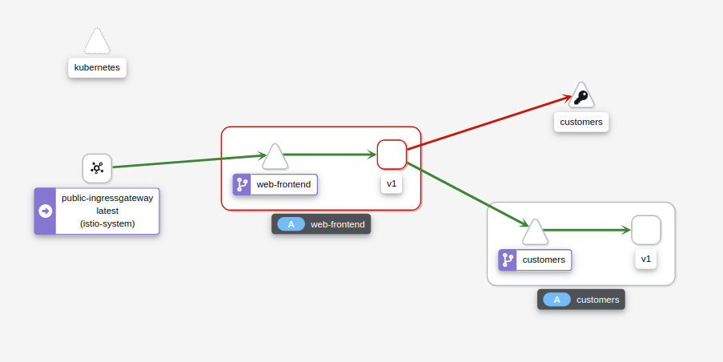
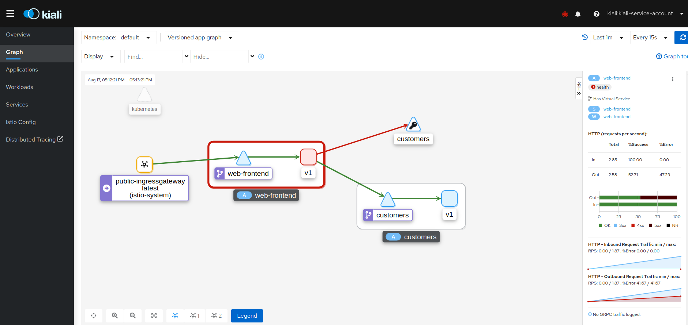

# Observing failure injection and delays in Grafana, Jaeger, and Kiali

In this lab, we will deploy the Web Frontend and Customers v1 service. We will then inject a failure, a delay, and observe both in Zipkin, Kiali, and Grafana.


Let's enable automatic sidecar injection on the default namespace by adding  the label istio-injection=enabled:

```bash
kubectl label namespace default istio-injection=enabled
```

Check that the `default` namespace contains the label for Istio proxy injection.

```bash
kubectl get namespace -L istio-injection
```

```bash
default             Active   19h   enabled
kube-system         Active   19h
kube-public         Active   19h
kube-node-lease     Active   19h
flux-system         Active   19h
bigbang             Active   16h
jaeger              Active   16h   enabled
gatekeeper-system   Active   16h
istio-operator      Active   16h   disabled
logging             Active   16h   enabled
monitoring          Active   16h
kiali               Active   16h   enabled
istio-system        Active   16h
eck-operator        Active   16h
```

Next, we will deploy the Web Frontend, Service, and VirtualService.

```yaml
apiVersion: apps/v1
kind: Deployment
metadata:
  name: web-frontend
  labels:
    app: web-frontend
spec:
  replicas: 1
  selector:
    matchLabels:
      app: web-frontend
  template:
    metadata:
      labels:
        app: web-frontend
        version: v1
    spec:
      containers:
        - image: gcr.io/tetratelabs/web-frontend:1.0.0
          imagePullPolicy: Always
          name: web
          ports:
            - containerPort: 8080
          env:
            - name: CUSTOMER_SERVICE_URL
              value: 'http://customers.default.svc.cluster.local'
---
kind: Service
apiVersion: v1
metadata:
  name: web-frontend
  labels:
    app: web-frontend
spec:
  selector:
    app: web-frontend
  ports:
    - port: 80
      name: http
      targetPort: 8080
---
apiVersion: networking.istio.io/v1alpha3
kind: VirtualService
metadata:
  name: web-frontend
spec:
  hosts:
    - 'frontend.bigbang.dev'
  gateways:
    - istio-system/public
  http:
    - route:
        - destination:
            host: web-frontend.default.svc.cluster.local
            port:
              number: 80

```
Notice we are setting an environment variable called CUSTOMER_SERVICE_URL that points to the customers service we will deploy next. The Web Frontend uses that URL to make a call to the Customer service.

Save the above YAML to `web-frontend.yaml` and create the resources using `kubectl apply -f web-frontend.yaml`.


Lastly, we will deploy the Customers v1 and corresponding resources.

```yaml
apiVersion: apps/v1
kind: Deployment
metadata:
  name: customers-v1
  labels:
    app: customers
    version: v1
spec:
  replicas: 1
  selector:
    matchLabels:
      app: customers
      version: v1
  template:
    metadata:
      labels:
        app: customers
        version: v1
    spec:
      containers:
        - image: gcr.io/tetratelabs/customers:1.0.0
          imagePullPolicy: Always
          name: svc
          ports:
            - containerPort: 3000
---
kind: Service
apiVersion: v1
metadata:
  name: customers
  labels:
    app: customers
spec:
  selector:
    app: customers
  ports:
    - port: 80
      name: http
      targetPort: 3000
---
apiVersion: networking.istio.io/v1alpha3
kind: DestinationRule
metadata:
  name: customers
spec:
  host: customers.default.svc.cluster.local
  subsets:
    - name: v1
      labels:
        version: v1
---
apiVersion: networking.istio.io/v1alpha3
kind: VirtualService
metadata:
  name: customers
spec:
  hosts:
    - 'customers.default.svc.cluster.local'
  http:
    - route:
        - destination:
            host: customers.default.svc.cluster.local
            port:
              number: 80
            subset: v1
```

Save the above YAML to `customers.yaml` and create the resources using `kubectl apply -f customers.yaml`.

With the applications deployed, let's inject a 5-second delay to the Customers service for 50% of all requests. We will inject the delay in the customers VirtualService:

```yaml
apiVersion: networking.istio.io/v1alpha3
kind: VirtualService
metadata:
  name: customers
spec:
  hosts:
    - 'customers.default.svc.cluster.local'
  http:
    - route:
        - destination:
            host: customers.default.svc.cluster.local
            port:
              number: 80
            subset: v1
      fault:
        delay:
          percent: 50
          fixedDelay: 5s
```

Save above YAML to `customers-delay.yaml` and update the VirtualService using `kubectl apply -f customers-delay.yaml`.


>To reach the host `frontend.bigbang.dev`, it is necessary to add the following line in /etc/hosts:
>
>```bash
><public-ip> frontend.bigbang.dev
>```


To generate some traffic, let's open a separate terminal window and start making requests to the `frontend.bigbang.dev` in a loop:

```bash
for i in $(seq 1 1000); do curl -s -o /dev/null "https://frontend.bigbang.dev/"; done
```

It could be noticed in the Grafana Dashboard some of the requests taking longer than usual. Let's open Grafana and observe these delays.

When Grafana opens in `grafana.bigbang.dev`, click `Home` and the `Istio Service Dashboard`. On the dashboard, make sure to select the web-frontend.default.svc.cluster.local in the Service dropdown.

Expand the Service Workloads section and you will notice the increased duration on the Incoming Request Duration by Service Workload graph, as shown in the figure below. Of the total incoming requests, 50 percent rise to more than 5 seconds of delay while the other 50 percent are close to zero.



Let's see how this delay shows up in Jaeger. Open `tracing.bigbang.dev`. On the main screen, select sevice `web-frontend.default`, then add the `minDuration` criteria and enter 5s and click the search button to find traces.



Click on one of the traces to open the details page. On the details page, we will notice the duration is 5 seconds. We will also see the response_flags tag set to DI. "DI" indicates that the request was delayed.



Let's update the VirtualService again and this time, we will inject a fault and return HTTP 500 for 50% of the requests.

```yaml
apiVersion: networking.istio.io/v1alpha3
kind: VirtualService
metadata:
  name: customers
spec:
  hosts:
    - 'customers.default.svc.cluster.local'
  http:
    - route:
        - destination:
            host: customers.default.svc.cluster.local
            port:
              number: 80
            subset: v1
      fault:
        abort:
          httpStatus: 500
          percentage:
            value: 50
```

Save the above YAML to `customers-fault.yaml` and update the VirtualService with `kubectl apply -f customers-fault.yaml`.

We need to generate some traffic, making requests to the `frontend.bigbang.dev` in a loop as shown above.

Go back to Grafana and open the Istio Mesh Dashboard. Note how the global success rate has dropped as well as the graph showing 5xx responses.



From the same dashboard, we can click the web-frontend.default workload from the list of workloads to open a dedicated dashboard for that workload.

Expand the Outbound Services and you'll notice a graph called "Outgoing Requests By Destination And Response Code". The graph will show a clear breakdown of HTTP 200 and HTTP 500 responses from the customers service.



In jaeger we search for traces again (we can remove the min duration), we will notice the traces with errors will show up in red color, as shown below.



If you click on the trace you will notice the response_flags are set to FI, which stands for Failure Injection.



Let's also open Kiali at `kiali.bigbang.dev` and look at the service graph by clicking the Graph link from the sidebar. You will notice how the web-frontend service has a red border, as shown below.

> Remember obtain the kiali login token with the following command:
>
>```bash
>kubectl get secret -n kiali $(kubectl get sa kiali-service-account -n kiali -o jsonpath={.secrets[0].name}) -o jsonpath={.data.token} | base64 -d
>```



If we click on the web-frontend service and look at the sidebar on the right, you will notice the HTTP requests' details. The graph shows the percentage of success and failures. The success rate of outgoing requests is around 50%, which corresponds to the percentage value we set in the VirtualService.



## Clean-up

The following commands will clean-up your cluster.

Delete the the service, deployment and virtual service of `customer` and `web-frontend`.

```bash
kubectl delete -f customers.yaml
kubectl delete -f web-frontend.yaml
```
