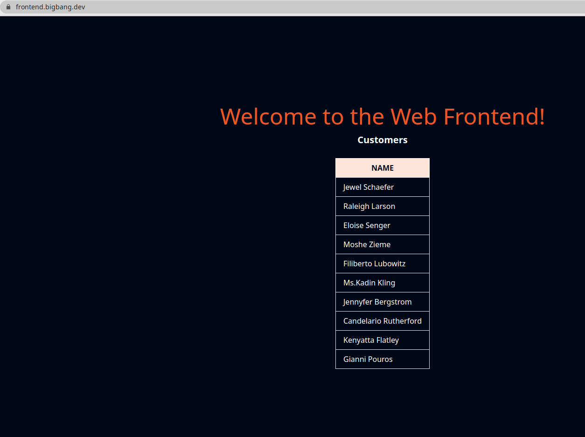

# Traffic Management

One of the core capabilities of Istio is traffic management, and due to that, it’s generally a deep functional area. In this section, the routing capabilities of Istio will be presented. Most of the examples will be directed to configure traffic flow, enabling you to do things like canary new deployments, set timeout and retry policies that are consistent across services. The material that covers traffic routing in Istio is usually splitted in simple and advanced for a better understanding. In this section will cover simple traffic routing.

# Simple traffic routing

In the following example shows how to route traffic between different service versions using weights. We will start by deploying a Web Frontend application and a Customer service version v1. We will then deploy the Customer service version v2 and split the traffic between the two versions using subsets.


Let's enable automatic sidecar injection on the default namespace by adding  the label istio-injection=enabled:

```bash
kubectl label namespace default istio-injection=enabled
```

Check that the `default` namespace contains the label for Istio proxy injection.

```bash
kubectl get namespace -L istio-injection
```

```bash
default             Active   19h   enabled
kube-system         Active   19h
kube-public         Active   19h
kube-node-lease     Active   19h
flux-system         Active   19h
bigbang             Active   16h
jaeger              Active   16h   enabled
gatekeeper-system   Active   16h
istio-operator      Active   16h   disabled
logging             Active   16h   enabled
monitoring          Active   16h
kiali               Active   16h   enabled
istio-system        Active   16h
eck-operator        Active   16h
```

Next, we will create the Web Frontend and the Customer service deployments and corresponding Kubernetes services. Let's start with the web-frontend first:

```yaml
apiVersion: apps/v1
kind: Deployment
metadata:
  name: web-frontend
  labels:
    app: web-frontend
spec:
  replicas: 1
  selector:
    matchLabels:
      app: web-frontend
  template:
    metadata:
      labels:
        app: web-frontend
        version: v1
    spec:
      containers:
        - image: gcr.io/tetratelabs/web-frontend:1.0.0
          imagePullPolicy: Always
          name: web
          ports:
            - containerPort: 8080
          env:
            - name: CUSTOMER_SERVICE_URL
              value: 'http://customers.default.svc.cluster.local'
---
kind: Service
apiVersion: v1
metadata:
  name: web-frontend
  labels:
    app: web-frontend
spec:
  selector:
    app: web-frontend
  ports:
    - port: 80
      name: http
      targetPort: 8080
```

Notice we are setting an environment variable called `CUSTOMER_SERVICE_URL` that points to the customers service we will deploy next. The Web Frontend uses that URL to make a call to the Customer service.

Save the above YAML to `web-frontend.yaml` and create the deployment and service using `kubectl apply -f web-frontend.yaml`.

Now we can deploy the v1 of the Customer service. Notice how we set the version: v1 label in the Pod template. However, the Service only uses `app: customers` in its selector. That's because we will create the subsets in the DestinationRule, and those will apply the additional version label to the selector, allowing us to reach the Pods running specific versions.

```yaml
apiVersion: apps/v1
kind: Deployment
metadata:
  name: customers-v1
  labels:
    app: customers
    version: v1
spec:
  replicas: 1
  selector:
    matchLabels:
      app: customers
      version: v1
  template:
    metadata:
      labels:
        app: customers
        version: v1
    spec:
      containers:
        - image: gcr.io/tetratelabs/customers:1.0.0
          imagePullPolicy: Always
          name: svc
          ports:
            - containerPort: 3000
---
kind: Service
apiVersion: v1
metadata:
  name: customers
  labels:
    app: customers
spec:
  selector:
    app: customers
  ports:
    - port: 80
      name: http
      targetPort: 3000
```

Save the above to `customers-v1.yaml` and create the deployment and service using `kubectl apply -f customers-v1.yaml`.

We should have both applications deployed and running:

```bash
$ kubectl get po
NAME                            READY   STATUS    RESTARTS   AGE
customers-v1-7857944975-5lxc8   2/2     Running   0          36s
web-frontend-659f65f49-jz58r    2/2     Running   0          3m38s
```

We can now create a VirtualService for the web-frontend and bind it to the Ingress Gateway `istio-system/public` resource:

```yaml
apiVersion: networking.istio.io/v1alpha3
kind: VirtualService
metadata:
  name: web-frontend
spec:
  hosts:
    - 'frontend.bigbang.dev'
  gateways:
    - istio-system/public
  http:
    - route:
        - destination:
            host: web-frontend.default.svc.cluster.local
            port:
              number: 80

```
Save the above YAML to `web-frontend-vs.yaml` and create the VirtualService using `kubectl apply -f web-frontend-vs.yaml`.


>To reach the host `frontend.bigbang.dev`, it is necessary to add the following line in /etc/hosts:
>
>```bash
><public-ip> frontend.bigbang.dev
>```

We can now open the `frontend.bigbang.dev` in the browser, and get to the Web Frontend that shows the customers list from the Customers service, as shown in the figure below.



If we need to update the Customer Service to version 2, the responses that the `frontend.bigbang.dev` will get back when calling the http://customers.default.svc.cluster.local would be random. They would either come from the v2 or v1 version of the Customers service.

We need to create the DestinationRule for the Customers service and define the two subsets, representing v1 and v2 versions. Then, we can create a VirtualService and route all traffic to the v1 subset. After that, we can deploy the v2 version of the Customers service without impacting the existing services.

Let's start with the `DestinationRule` and two subsets:

```yaml
apiVersion: networking.istio.io/v1alpha3
kind: DestinationRule
metadata:
  name: customers
spec:
  host: customers.default.svc.cluster.local
  subsets:
    - name: v1
      labels:
        version: v1
    - name: v2
      labels:
        version: v2
```

Save the above to `customers-dr.yaml` and create the `DestinationRule` using `kubectl apply -f customers-dr.yaml`.

We can create the VirtualService and specify the v1 subset in the destination:

```yaml

apiVersion: networking.istio.io/v1alpha3
kind: VirtualService
metadata:
  name: customers
spec:
  hosts:
    - 'customers.default.svc.cluster.local'
  http:
    - route:
        - destination:
            host: customers.default.svc.cluster.local
            port:
              number: 80
            subset: v1
```

Whenever a request is sent to the Kubernetes Customers service, it will get routed to the same service's v1 subset.

Save the above YAML to `customers-vs.yaml` and create the `VirtualService` using `kubectl apply -f customers-vs.yaml`.

We are now ready to deploy the v2 version of the Customers service. The v2 version returns the same list of customers as the previous version, but it also includes the City name. Let's create the Customers v2 deployment. We don't need to deploy the Kubernetes Services, because we've already deployed one with the v1 version.

```yaml
apiVersion: apps/v1
kind: Deployment
metadata:
  name: customers-v2
  labels:
    app: customers
    version: v2
spec:
  replicas: 1
  selector:
    matchLabels:
      app: customers
      version: v2
  template:
    metadata:
      labels:
        app: customers
        version: v2
    spec:
      containers:
        - image: gcr.io/tetratelabs/customers:2.0.0
          imagePullPolicy: Always
          name: svc
          ports:
            - containerPort: 3000
```

The deployment is nearly identical to the v1 deployment. The only differences are in the Docker image version that's being used and the v2 value set to the version label.

Save the above YAML to `customers-v2.yaml` and create the deployment using `kubectl apply -f customers-v2.yaml`.

Because of the VirtualService we created earlier, all traffic will be going to the subset v1. Let's use the weight field and modify the VirtualService, so 50% of the traffic is being sent to the v1 subset and the other 50% to the v2 subset.

To do that, we will create a second destination, with the same hostname, but with a different subset. We will also add the weight: 50 to destinations to split the traffic between both versions equally.

```yaml
apiVersion: networking.istio.io/v1alpha3
kind: VirtualService
metadata:
  name: customers
spec:
  hosts:
    - 'customers.default.svc.cluster.local'
  http:
    - route:
        - destination:
            host: customers.default.svc.cluster.local
            port:
              number: 80
            subset: v1
          weight: 50
        - destination:
            host: customers.default.svc.cluster.local
            port:
              number: 80
            subset: v2
          weight: 50
```

Save the above YAML to `customers-50-50.yaml` and update the VirtualService using `kubectl apply -f customers-50-50.yaml`.

Open the `frontend.bigbang.dev` in the browser and refresh the page a couple of times to see the different responses. The response from the Customers v2 is shown in the figure below.


To change the proportion of the traffic sent to one or the other version, we can update the VirtualService. Similarly, we could add v3 or v4 versions as well and split the traffic between those versions.

## Clean-up
The following commands will clean-up your cluster.

Delete the the service, deployment and virtual service of `customer` and `web-frontend`.

```bash
kubectl delete -f web-frontend.yaml
kubectl delete -f web-frontend-vs.yaml
kubectl delete -f customers-v1.yaml
kubectl delete -f customers-v2.yaml
kubectl delete -f customers-vs.yaml
kubectl delete -f customers-dr.yaml
```
