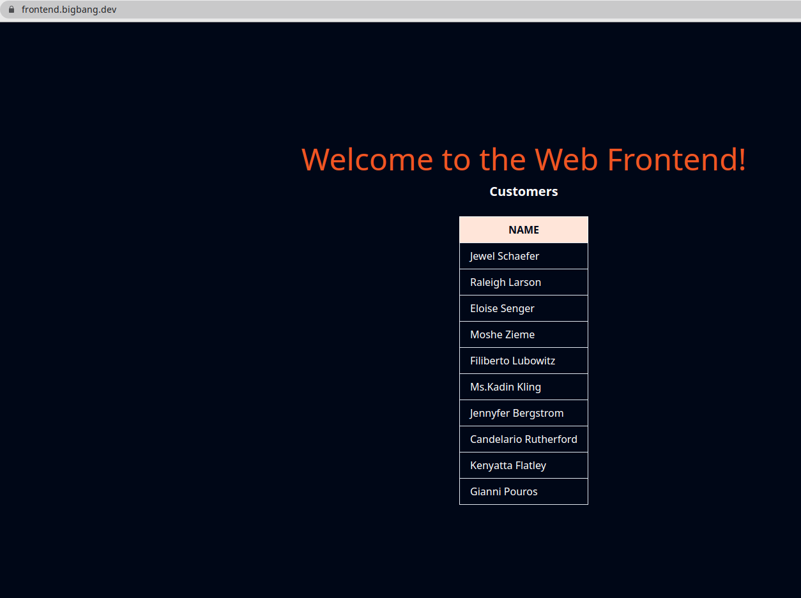
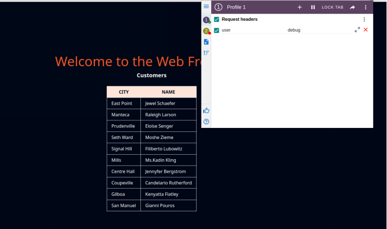

# Advanced traffic routing

In this lab, we will learn how to use request properties to route the traffic between multiple service versions.

Let's enable automatic sidecar injection on the default namespace by adding the label istio-injection=enabled:

```bash
kubectl label namespace default istio-injection=enabled
```

Check that the `default` namespace contains the label for Istio proxy injection.

```bash
kubectl get namespace -L istio-injection
```

```bash
default             Active   19h   enabled
kube-system         Active   19h   
kube-public         Active   19h   
kube-node-lease     Active   19h   
flux-system         Active   19h   
bigbang             Active   16h   
jaeger              Active   16h   enabled
gatekeeper-system   Active   16h   
istio-operator      Active   16h   disabled
logging             Active   16h   enabled
monitoring          Active   16h   
kiali               Active   16h   enabled
istio-system        Active   16h   
eck-operator        Active   16h   
```

Next, we will deploy the Web Frontend, Customers v1, Customers v2, and the corresponding VirtualServices and DestinationRule. Once everything is deployed, all traffic will be routed to the Customers v1.

```yaml
apiVersion: apps/v1
kind: Deployment
metadata:
  name: web-frontend
  labels:
    app: web-frontend
spec:
  replicas: 1
  selector:
    matchLabels:
      app: web-frontend
  template:
    metadata:
      labels:
        app: web-frontend
        version: v1
    spec:
      containers:
        - image: gcr.io/tetratelabs/web-frontend:1.0.0
          imagePullPolicy: Always
          name: web
          ports:
            - containerPort: 8080
          env:
            - name: CUSTOMER_SERVICE_URL
              value: 'http://customers.default.svc.cluster.local'
---
kind: Service
apiVersion: v1
metadata:
  name: web-frontend
  labels:
    app: web-frontend
spec:
  selector:
    app: web-frontend
  ports:
    - port: 80
      name: http
      targetPort: 8080
---
apiVersion: networking.istio.io/v1alpha3
kind: VirtualService
metadata:
  name: web-frontend
spec:
  hosts:
    - 'frontend.bigbang.dev'
  gateways:
    - istio-system/public
  http:
    - route:
        - destination:
            host: web-frontend.default.svc.cluster.local
            port:
              number: 80
```

Save the above YAML to `web-frontend.yaml` and create the deployment and service using `kubectl apply -f web-frontend.yaml`.

```yaml
apiVersion: apps/v1
kind: Deployment
metadata:
  name: customers-v1
  labels:
    app: customers
    version: v1
spec:
  replicas: 1
  selector:
    matchLabels:
      app: customers
      version: v1
  template:
    metadata:
      labels:
        app: customers
        version: v1
    spec:
      containers:
        - image: gcr.io/tetratelabs/customers:1.0.0
          imagePullPolicy: Always
          name: svc
          ports:
            - containerPort: 3000
---
apiVersion: apps/v1
kind: Deployment
metadata:
  name: customers-v2
  labels:
    app: customers
    version: v2
spec:
  replicas: 1
  selector:
    matchLabels:
      app: customers
      version: v2
  template:
    metadata:
      labels:
        app: customers
        version: v2
    spec:
      containers:
        - image: gcr.io/tetratelabs/customers:2.0.0
          imagePullPolicy: Always
          name: svc
          ports:
            - containerPort: 3000
---
kind: Service
apiVersion: v1
metadata:
  name: customers
  labels:
    app: customers
spec:
  selector:
    app: customers
  ports:
    - port: 80
      name: http
      targetPort: 3000
---
apiVersion: networking.istio.io/v1alpha3
kind: VirtualService
metadata:
  name: customers
spec:
  hosts:
    - 'customers.default.svc.cluster.local'
  http:
    - route:
        - destination:
            host: customers.default.svc.cluster.local
            port:
              number: 80
            subset: v1
---
apiVersion: networking.istio.io/v1alpha3
kind: DestinationRule
metadata:
  name: customers
spec:
  host: customers.default.svc.cluster.local
  subsets:
    - name: v1
      labels:
        version: v1
    - name: v2
      labels:
        version: v2
```

Save the above YAML to `customers-v1-v2.yaml` and create the resources with `kubectl apply -f customers-v1-v2.yaml`.

>To reach the host `frontend.bigbang.dev`, it is necessary to add the following line in /etc/hosts:
>
>```bash
><public-ip> frontend.bigbang.dev
>```


To ensure everything is deployed and works correctly, open the `frontend.bigbang.dev` and ensure we are getting the responses back from the Customers v1. we should only see the NAME column in the response.



We will update the customers VirtualService and update how the traffic is being routed between two versions of the customers service.

Let's look at a YAML that routes the traffic to Customers v2, if the request contains a header user: debug. If the header is not set, we are routed to the Customers v1.

```yaml
apiVersion: networking.istio.io/v1alpha3
kind: VirtualService
metadata:
  name: customers
spec:
  hosts:
    - 'customers.default.svc.cluster.local'
  http:
  - match:
    - headers:
        user:
          exact: debug
    route:
    - destination:
        host: customers.default.svc.cluster.local
        port:
          number: 80
        subset: v2
  - route:
      - destination:
          host: customers.default.svc.cluster.local
          port:
            number: 80
          subset: v1
```

Save the above YAML to `customers-vs-split.yaml` and update the VirtualService with `kubectl apply -f customers-vs-split.yaml`.

> The destinations in the VirtualService would also work if we didn't provide the port number. That's because the service has a single port defined.

If we open `frontend.bigbang.dev`, we should still get back the response from the Customers v1. If we add the header `user: debug` to the request we will notice that the customers' response is from the Customers v2. We can use the [ModHeader](https://chrome.google.com/webstore/detail/modheader/idgpnmonknjnojddfkpgkljpfnnfcklj?hl=en) extension to modify the headers from the browser:



Alternatively, we can use cURL and add the header to the request like this:

```bash
curl -H "user: debug" https://frontend.bigbang.dev/

...

    <tr>
      
      <td class="border px-4 py-2">San Manuel</td>
      
      <td class="border px-4 py-2">Gianni Pouros</td>
      
    </tr>

...
```

if the header `user: debug` is not used, only the name is observed:


```bash
curl https://frontend.bigbang.dev/

...

    <tr>
      
      <td class="border px-4 py-2">Gianni Pouros</td>
      
    </tr>

...

```

## Clean-up

The following commands will clean-up your cluster.

Delete the the service, deployment and virtual service of `customer` and `web-frontend`.

```bash
kubectl delete -f web-frontend.yaml
kubectl delete -f customers-v1-v2.yaml
```
