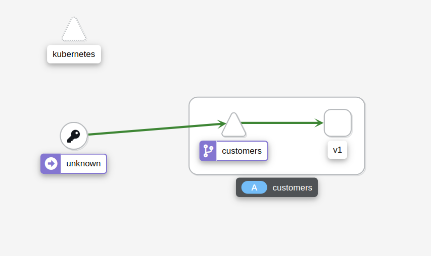
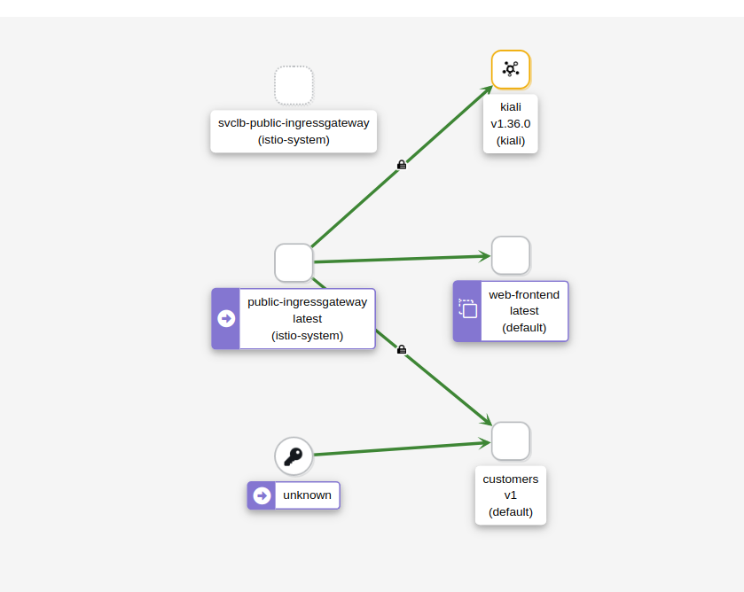

# Enable TLS

In this lab, we will deploy the sample application (Web Frontend and the Customer service). The web frontend will be deployed without an Envoy proxy sidecar, while the Customer service will have the sidecar injected. With this set up, we will see how Istio can send both mTLS and plain text traffic, and how to change the TLS mode to STRICT.

We will create the Web Frontend and the Customer service deployments and related Kubernetes services. We will disable the automatic sidecar injection in the default namespace before we start deploying, so the proxy doesn't get injected into the Web frontend deployment. Before we deploy the Customer service, we will enable the injection again.

To disable automatic sidecar injection:

```bash
kubectl label namespace default istio-injection-
```

Check that the `default` namespace doesn't contains the label for Istio proxy injection.

```bash
kubectl get namespace -L istio-injection
```

```bash
NAME                STATUS   AGE     ISTIO-INJECTION
kube-system         Active   5d17h   
kube-public         Active   5d17h   
kube-node-lease     Active   5d17h   
flux-system         Active   5d17h   
bigbang             Active   5d17h   
gatekeeper-system   Active   5d17h   
istio-system        Active   5d17h   
jaeger              Active   5d17h   enabled
monitoring          Active   5d17h   
kiali               Active   5d17h   enabled
istio-operator      Active   5d17h   disabled
eck-operator        Active   5d17h   
logging             Active   5d17h   enabled
default             Active   5d17h   
```

With injection disabled, let's deploy the web-frontend:

```yaml
apiVersion: apps/v1
kind: Deployment
metadata:
  name: web-frontend
  labels:
    app: web-frontend
spec:
  replicas: 1
  selector:
    matchLabels:
      app: web-frontend
  template:
    metadata:
      labels:
        app: web-frontend
        version: v1
    spec:
      containers:
        - image: gcr.io/tetratelabs/web-frontend:1.0.0
          imagePullPolicy: Always
          name: web
          ports:
            - containerPort: 8080
          env:
            - name: CUSTOMER_SERVICE_URL
              value: 'http://customers.default.svc.cluster.local'
---
kind: Service
apiVersion: v1
metadata:
  name: web-frontend
  labels:
    app: web-frontend
spec:
  selector:
    app: web-frontend
  ports:
    - port: 80
      name: http
      targetPort: 8080
---
apiVersion: networking.istio.io/v1alpha3
kind: VirtualService
metadata:
  name: web-frontend
spec:
  hosts:
    - 'frontend.bigbang.dev'
  gateways:
    - istio-system/public
  http:
    - route:
        - destination:
            host: web-frontend.default.svc.cluster.local
            port:
              number: 80
```

Save the above YAML to `web-frontend.yaml` and create the deployment and service using `kubectl apply -f web-frontend.yaml`. If we look at the running Pods, we should see one Pod with a single container running, indicated by the 1/1 in the READY column.

```bash
kubectl get po
NAME                            READY   STATUS    RESTARTS   AGE
web-frontend-69b64f974c-9ml4x   1/1     Running   0          62s
```


Let's enable automatic sidecar injection on the default namespace by adding  the label istio-injection=enabled:

```bash
kubectl label namespace default istio-injection=enabled
```

Check that the `default` namespace contains the label for Istio proxy injection.

```bash
kubectl get namespace -L istio-injection
```

```bash
NAME                STATUS   AGE     ISTIO-INJECTION
kube-system         Active   5d17h   
kube-public         Active   5d17h   
kube-node-lease     Active   5d17h   
flux-system         Active   5d17h   
bigbang             Active   5d17h   
gatekeeper-system   Active   5d17h   
istio-system        Active   5d17h   
jaeger              Active   5d17h   enabled
monitoring          Active   5d17h   
kiali               Active   5d17h   enabled
istio-operator      Active   5d17h   disabled
eck-operator        Active   5d17h   
logging             Active   5d17h   enabled
default             Active   5d17h   enabled
```

And the deploy the v1 of the Customer service:

```yaml
apiVersion: apps/v1
kind: Deployment
metadata:
  name: customers-v1
  labels:
    app: customers
    version: v1
spec:
  replicas: 1
  selector:
    matchLabels:
      app: customers
      version: v1
  template:
    metadata:
      labels:
        app: customers
        version: v1
    spec:
      containers:
        - image: gcr.io/tetratelabs/customers:1.0.0
          imagePullPolicy: Always
          name: svc
          ports:
            - containerPort: 3000
---
kind: Service
apiVersion: v1
metadata:
  name: customers
  labels:
    app: customers
spec:
  selector:
    app: customers
  ports:
    - port: 80
      name: http
      targetPort: 3000
---
apiVersion: networking.istio.io/v1alpha3
kind: VirtualService
metadata:
  name: customers
spec:
  hosts:
    - 'customers.default.svc.cluster.local'
  http:
    - route:
        - destination:
            host: customers.default.svc.cluster.local
            port:
              number: 80
```

Save the above to `customers-v1.yaml` and create the deployment and service using `kubectl apply -f customers-v1.yaml`.

We should have both applications deployed and running,  the customers service will have two containers, and the web frontend service will have one:

```bash
kubectl get po

NAME                            READY   STATUS    RESTARTS   AGE
web-frontend-69b64f974c-9ml4x   1/1     Running   0          5m47s
customers-v1-7b5b4b76fc-qbsqd   2/2     Running   0          10m
```

>To reach the host `frontend.bigbang.dev`, it is necessary to add the following line in /etc/hosts:
>
>```bash
><public-ip> frontend.bigbang.dev
>```

Accessing the `frontend.bigbang.dev` works because of the PERMISSIVE mode. Istio automatically configures workload sidecars to use mutual TLS when calling other workloads. By default, Istio configures the destination workloads using PERMISSIVE mode. When PERMISSIVE mode is enabled, a service can accept both plain text and mutual TLS traffic. In order to only allow mutual TLS traffic, the configuration needs to be changed to STRICT mode. In this case, the ingress gateway sends the petitions in plain text traffic to the Web frontend because there's no proxy, and  the web page can still be viewed, due to this PERMISSIVE mode it is implemented.

If we open `kiali.bigbang.dev` and look at the Graph, you will notice that Kiali detects calls being made from the ingress gateway to `web-frontend`. However, the calls being made to the `customers service` are coming from unknown service. This is because there's no proxy next to the `web frontend`, and Istio doesn't know who, where or what that service is.


> Remember obtain the kiali login token with the following command:
> 
>```bash
>kubectl get secret -n kiali $(kubectl get sa kiali-service-account -n kiali -o jsonpath={.secrets[0].name}) -o jsonpath={.data.token} | base64 -d
>```



Let's update the customers VirtualService and attach the gateway to it. This will allow us to make calls directly to the customers service.

```yaml
apiVersion: networking.istio.io/v1alpha3
kind: VirtualService
metadata:
  name: customers
spec:
  hosts:
    - 'customers.bigbang.dev'
  gateways:
    - istio-system/public
  http:
    - route:
        - destination:
            host: customers.default.svc.cluster.local
            port:
              number: 80
```

Save the above to `vs-customers-gateway.yaml` and update the VirtualService using `kubectl apply -f vs-customers-gateway.yaml`.

Now, we can now specify the Host header and we'll be able to send the requests through the ingress gateway to the customers service:

```bash
curl -H "Host: customers.bigbang.dev" https://frontend.bigbang.dev/
```

```bash
[{"name":"Jewel Schaefer"},{"name":"Raleigh Larson"},{"name":"Eloise Senger"},{"name":"Moshe Zieme"},{"name":"Filiberto Lubowitz"},{"name":"Ms.Kadin Kling"},{"name":"Jennyfer Bergstrom"},{"name":"Candelario Rutherford"},{"name":"Kenyatta Flatley"},{"name":"Gianni Pouros"}]
```

To generate some traffic to both the Web frontend and Customers service through the ingress, open the two terminal windows and run one command in each:

```bash
// Terminal 1 
while true; do curl -H "Host: customers.bigbang.dev" https://frontend.bigbang.dev/; done
...
// Terminal 2
while true; do curl https://frontend.bigbang.dev/; done
```

Open Kiali and look at the Graph. From the Display dropdown, make sure we check the Security option. You should see a graph similar to the one in the following figure.



Notice there is a padlock icon between the ingress gateway and the customers service, which means the traffic is sent using mTLS. However, there's no padlock between the unknown (web frontend) and the customers service. Istio is sending plain text traffic to and from the services without the sidecar injected.

Let's see what happens if we enable mTLS in STRICT mode. We expect the calls from the frontend to the customer service to start failing because there's no proxy injected to do the mTLS communication. On the other hand, the calls from the ingress gateway to the customer service will continue working.

```yaml
apiVersion: security.istio.io/v1beta1
kind: PeerAuthentication
metadata:
  name: default
  namespace: default
spec:
  mtls:
    mode: STRICT
```
Save the above to `pa-default.yaml` and create the PeerAuthentication using `kubectl apply -f pa-default.yaml`.

If we still have the request loop running we will start seeing the ECONNRESET error message coming from the web frontend. This error indicates that the customers side closed the connection. In our case, it was because it was expecting an mTLS connection.

If we delete the PeerAuthentication resource deployed earlier `kubectl delete -f pa-default.yaml`, Istio returns to its default (PERMISSIVE mode), and the errors will disappear.

## Clean-up

The following commands will clean-up your cluster.

Delete the the service, deployment and virtual service of `customer` and `web-frontend`.
```bash
kubectl delete -f web-frontend.yaml
kubectl delete -f customers-v1.yaml
```
