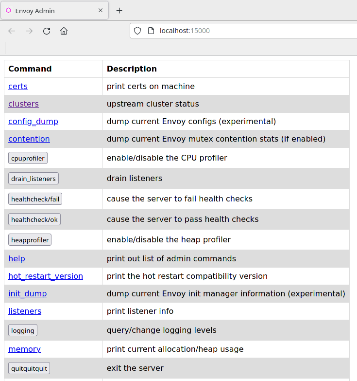
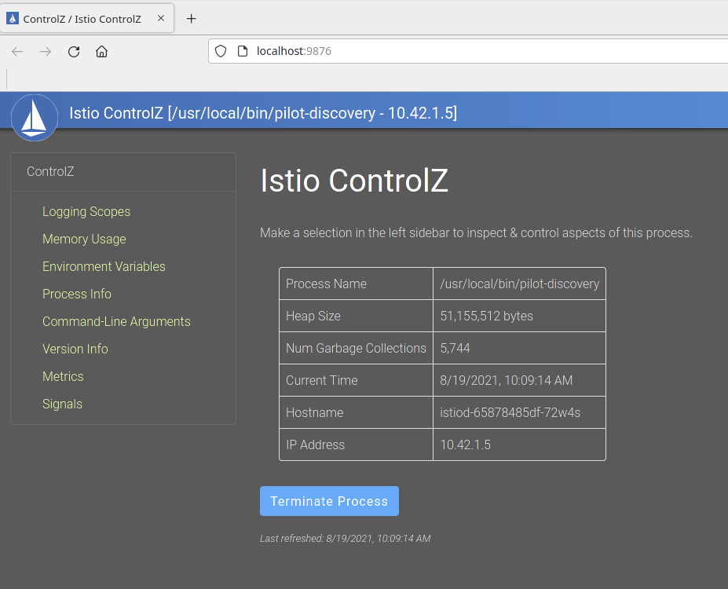

# Envoy Demo

One of Envoy’s many powers is traffic routing and load balancing. For any dynamic environment that’s subject to regular changes, it needs a dynamic configuration mechanism that is capable of enabling users to make those changes easily, and most importantly, with no downtime.

Let's deploy Web frontend and customer service applications as an example to see how Envoy determines where to send the requests from the web frontend to the customer service (customers.default.svc.cluster.local).

```yaml
apiVersion: apps/v1
kind: Deployment
metadata:
  name: web-frontend
  labels:
    app: web-frontend
spec:
  replicas: 1
  selector:
    matchLabels:
      app: web-frontend
  template:
    metadata:
      labels:
        app: web-frontend
        version: v1
    spec:
      containers:
        - image: gcr.io/tetratelabs/web-frontend:1.0.0
          imagePullPolicy: Always
          name: web
          ports:
            - containerPort: 8080
          env:
            - name: CUSTOMER_SERVICE_URL
              value: 'http://customers.default.svc.cluster.local'
---
kind: Service
apiVersion: v1
metadata:
  name: web-frontend
  labels:
    app: web-frontend
spec:
  selector:
    app: web-frontend
  ports:
    - port: 80
      name: http
      targetPort: 8080
---
apiVersion: networking.istio.io/v1alpha3
kind: VirtualService
metadata:
  name: web-frontend
spec:
  hosts:
    - 'frontend.bigbang.dev'
  gateways:
    - istio-system/public
  http:
    - route:
        - destination:
            host: web-frontend.default.svc.cluster.local
            port:
              number: 80
---
apiVersion: apps/v1
kind: Deployment
metadata:
  name: customers-v1
  labels:
    app: customers
    version: v1
spec:
  replicas: 1
  selector:
    matchLabels:
      app: customers
      version: v1
  template:
    metadata:
      labels:
        app: customers
        version: v1
    spec:
      containers:
        - image: gcr.io/tetratelabs/customers:1.0.0
          imagePullPolicy: Always
          name: svc
          ports:
            - containerPort: 3000
---
kind: Service
apiVersion: v1
metadata:
  name: customers
  labels:
    app: customers
spec:
  selector:
    app: customers
  ports:
    - port: 80
      name: http
      targetPort: 3000
```

Save the above to `envoy-demo-apps.yaml` and deploy the apps using `kubectl apply -f envoy-demo-apps.yaml`.

Using the `istioctl proxy-config` command, we can list all listeners of the web frontend pod.

List all listeners of the web frontend:

```bash
istioctl proxy-config listeners deployment/web-frontend
ADDRESS       PORT  MATCH                                                                 DESTINATION
10.43.0.10    53    ALL                                                                   Cluster: outbound|53||kube-dns.kube-system.svc.cluster.local
0.0.0.0       80    Trans: raw_buffer; App: HTTP                                          Route: 80
0.0.0.0       80    ALL                                                                   PassthroughCluster
10.43.253.168 80    Trans: raw_buffer; App: HTTP                                          Route: monitoring-monitoring-grafana.monitoring.svc.cluster.local:80
10.43.253.168 80    ALL                                                                   Cluster: outbound|80||monitoring-monitoring-grafana.monitoring.svc.cluster.local
10.43.0.1     443   ALL                                                                   Cluster: outbound|443||kubernetes.default.svc.cluster.local
10.43.105.55  443   ALL                                                                   Cluster: outbound|443||metrics-server.kube-system.svc.cluster.local
10.43.106.215 443   ALL                                                                   Cluster: outbound|443||public-ingressgateway.istio-system.svc.cluster.local
10.43.121.62  443   Trans: raw_buffer; App: HTTP                                          Route: gatekeeper-webhook-service.gatekeeper-system.svc.cluster.local:443
10.43.121.62  443   ALL                                                                   Cluster: outbound|443||gatekeeper-webhook-service.gatekeeper-system.svc.cluster.local
10.43.215.58  443   ALL                                                                   Cluster: outbound|443||elastic-operator-webhook.eck-operator.svc.cluster.local
10.43.42.125  443   ALL                                                                   Cluster: outbound|443||monitoring-monitoring-kube-operator.monitoring.svc.cluster.local
10.43.82.175  443   ALL                                                                   Cluster: outbound|443||istiod.istio-system.svc.cluster.local
0.0.0.0       2020  Trans: raw_buffer; App: HTTP                                          Route: 2020
0.0.0.0       2020  ALL                                                                   PassthroughCluster
0.0.0.0       2379  Trans: raw_buffer; App: HTTP                                          Route: 2379
0.0.0.0       2379  ALL                                                                   PassthroughCluster
172.18.0.2    4194  Trans: raw_buffer; App: HTTP                                          Route: monitoring-monitoring-kube-kubelet.kube-system.svc.cluster.local:4194
172.18.0.2    4194  ALL                                                                   Cluster: outbound|4194||monitoring-monitoring-kube-kubelet.kube-system.svc.cluster.local
172.18.0.3    4194  Trans: raw_buffer; App: HTTP                                          Route: monitoring-monitoring-kube-kubelet.kube-system.svc.cluster.local:4194
172.18.0.3    4194  ALL                                                                   Cluster: outbound|4194||monitoring-monitoring-kube-kubelet.kube-system.svc.cluster.local
172.18.0.4    4194  Trans: raw_buffer; App: HTTP                                          Route: monitoring-monitoring-kube-kubelet.kube-system.svc.cluster.local:4194
172.18.0.4    4194  ALL                                                                   Cluster: outbound|4194||monitoring-monitoring-kube-kubelet.kube-system.svc.cluster.local
172.18.0.5    4194  Trans: raw_buffer; App: HTTP                                          Route: monitoring-monitoring-kube-kubelet.kube-system.svc.cluster.local:4194
172.18.0.5    4194  ALL                                                                   Cluster: outbound|4194||monitoring-monitoring-kube-kubelet.kube-system.svc.cluster.local
0.0.0.0       5601  Trans: raw_buffer; App: HTTP                                          Route: 5601
0.0.0.0       5601  ALL                                                                   PassthroughCluster
10.42.1.11    5778  Trans: raw_buffer; App: HTTP                                          Route: jaeger-agent.jaeger.svc.cluster.local:5778
10.42.1.11    5778  ALL                                                                   Cluster: outbound|5778||jaeger-agent.jaeger.svc.cluster.local
0.0.0.0       8080  Trans: raw_buffer; App: HTTP                                          Route: 8080
0.0.0.0       8080  ALL                                                                   PassthroughCluster
0.0.0.0       8383  Trans: raw_buffer; App: HTTP                                          Route: 8383
0.0.0.0       8383  ALL                                                                   PassthroughCluster
10.43.245.181 8686  Trans: raw_buffer; App: HTTP                                          Route: jaeger-jaeger-jaeger-operator-met

....
```

The request from the web frontend to customers is an outbound HTTP request to port 80. This means that it gets handed off to the 0.0.0.0:80 virtual listener. We can use Istio CLI to filter the listeners by address and port. You can add the -o json to get a JSON representation of the listener:

```bash
istioctl proxy-config listeners deployment/web-frontend --address 0.0.0.0 --port 80 -o json

...
"rds": {
   "configSource": {
      "ads": {},
      "resourceApiVersion": "V3"
   },
   "routeConfigName": "80"
},
...
```

The listener uses RDS (Route Discovery Service) to find the route configuration (80 in our case). Routes are attached to listeners and contain rules that map virtual hosts to clusters. This allows us to create traffic routing rules because Envoy can look at headers or paths (the request metadata) and route traffic.

A route selects a cluster. A cluster is a group of similar upstream hosts that accept traffic - it's a collection of endpoints. For example, the collection of all instances of the Web Frontend service is a cluster. We can configure resiliency features within a cluster, such as circuit breakers, outlier detection, and TLS config.

Using the `routes` command, we can get the route details by filtering all routes by the name:

```bash
istioctl proxy-config route deployment/web-frontend --name 80 -o json
[
    {
    ....
            {
                "name": "customers.default.svc.cluster.local:80",
                "domains": [
                    "customers.default.svc.cluster.local",
                    "customers.default.svc.cluster.local:80",
                    "customers",
                    "customers:80",
                    "customers.default.svc.cluster",
                    "customers.default.svc.cluster:80",
                    "customers.default.svc",
                    "customers.default.svc:80",
                    "customers.default",
                    "customers.default:80",
                    "10.43.246.220",
                    "10.43.246.220:80"
                ],
                "routes": [
                    {
                        "name": "default",
                        "match": {
                            "prefix": "/"
                        },
                        "route": {
                            "cluster": "outbound|80||customers.default.svc.cluster.local",
                            "timeout": "0s",
                            "retryPolicy": {
                                "retryOn": "connect-failure,refused-stream,unavailable,cancelled,retriable-status-codes",
                                "numRetries": 2,
                                "retryHostPredicate": [
                                    {
                                        "name": "envoy.retry_host_predicates.previous_hosts"
                                    }
                                ],
                                "hostSelectionRetryMaxAttempts": "5",
                                "retriableStatusCodes": [
                                    503
                                ]
                            },
                            "maxStreamDuration": {
                                "maxStreamDuration": "0s"
                            }
    ....
```

The route `80` configuration has a virtual host for each service. However, because our request is being sent to `customers.default.svc.cluster.local`, Envoy selects the virtual host (`customers.default.svc.cluster.local:80`) that matches one of the domains.

Once the domain is matched, Envoy looks at the routes and picks the first one that matches the request. Since we don't have any special routing rules defined, it matches the first (and only) route that's defined and instructs Envoy to send the request to the cluster named `outbound|80||customers.default.svc.cluster.local`.  


>Note the cluster name can be `outbound | 80 | v1 | customers.default.svc.cluster.local`, if there is a DestinationRule in this deployment that creates a` v1` subset. If there are no subsets for a service, that part if left blank, as in this case.

Now that we have the cluster name, we can look up more details. To get an output that clearly shows the FQDN, port, subset and other information, you can omit the `-o json` flag:

```bash
istioctl proxy-config cluster deployment/web-frontend --fqdn customers.default.svc.cluster.local

SERVICE FQDN                            PORT     SUBSET     DIRECTION     TYPE     DESTINATION RULE
customers.default.svc.cluster.local     80       -          outbound      EDS   
```


Finally, using the cluster name, we can look up the actual endpoints the request will end up at:

```bash
istioctl proxy-config endpoints deployment/web-frontend --cluster "outbound|80||customers.default.svc.cluster.local"
ENDPOINT            STATUS      OUTLIER CHECK     CLUSTER
10.42.1.28:3000     HEALTHY     OK                outbound|80||customers.default.svc.cluster.local
```

The endpoint address equals the pod IP where the Customer application is running. If we scale the customers deployment, additional endpoints show up in the output, like this:

```bash
istioctl proxy-config endpoints deployment/web-frontend --cluster "outbound|80||customers.default.svc.cluster.local"

ENDPOINT            STATUS      OUTLIER CHECK     CLUSTER
10.42.1.28:3000     HEALTHY     OK                outbound|80||customers.default.svc.cluster.local
10.42.3.44:3000     HEALTHY     OK                outbound|80||customers.default.svc.cluster.local
```


## Envoy dashboard

We can retrieve the same data through the Envoy dashboard. You can open the dashboard by running `istioctl dashboard envoy [POD_NAME]` and view the envoy settings of any pod. The following figure shows the dashboard with the envoy configurations of the `customers-v1-7b5b4b76fc-vtx98` pod.

```bash
istioctl dashboard envoy deployment/customers-v1
```



## ControlZ 

The controlz command allows us to inspect and manipulate the internal state of an istiod instance. To open the dashboard, run `istioctl dashboard controlz [ISTIOD_POD_NAME].[NAMESPACE]`.

To get the name of the istiod pod, run the following command:

```bash
 kubectl get pod -n istio-system
NAME                                     READY   STATUS    RESTARTS   AGE
svclb-public-ingressgateway-qn299        4/4     Running   0          6d15h
svclb-public-ingressgateway-hbjjw        4/4     Running   0          6d15h
svclb-public-ingressgateway-2s6wv        4/4     Running   0          6d15h
svclb-public-ingressgateway-lc4dn        4/4     Running   0          6d15h
istiod-65878485df-72w4s                  1/1     Running   0          6d15h
public-ingressgateway-7c4f54bfb8-xj85f   1/1     Running   0          14h
```

Next, the command to open the dashboard controlz is executed:

```bash
istioctl dashboard controlz istiod-65878485df-72w4s.istio-system
```




## Cleanup

Remove the deployed resources:

```sh
kubectl delete -f envoy-demo-apps.yaml
```
